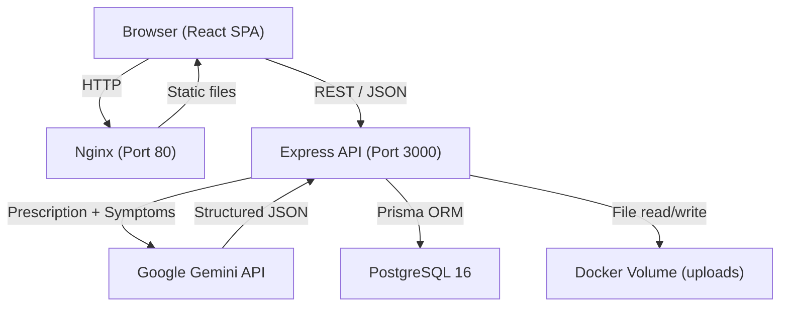

# Health Companion -- AI-Powered Prescription Analysis

A full-stack web application that lets users upload prescriptions, describe their symptoms, and receive AI-generated analysis including identified medicines, detected conditions, lifestyle recommendations, and doctor's advice. Built with React, Express, PostgreSQL, and Google Gemini.

---

## Architecture



The frontend is a single-page React application served by nginx. It communicates with the Express backend over REST. Authentication uses stateless JWTs. When the user triggers an analysis, the backend reads the uploaded file from disk, encodes it as base64, sends it alongside the patient's symptoms to Google Gemini, parses the structured JSON response, and persists the result to PostgreSQL so subsequent page loads never re-call the LLM.

---

## Tech Stack

| Layer          | Technology                                       |
| -------------- | ------------------------------------------------ |
| Frontend       | React 19, Vite 7, TailwindCSS 4, TanStack Router |
| UI Components  | Radix UI primitives, Lucide icons, shadcn/ui      |
| Backend        | Node.js 20, Express 4, TypeScript 5               |
| Validation     | Zod (frontend + backend)                          |
| Database       | PostgreSQL 16 (Alpine)                            |
| ORM            | Prisma 6                                          |
| AI             | Google Gemini API (`gemini-flash-latest`)          |
| Auth           | JWT (jsonwebtoken) + bcrypt                        |
| File Upload    | Multer (disk storage, 10 MB limit)                |
| HTTP Client    | Axios (frontend)                                   |
| Containerization | Docker multi-stage builds, Docker Compose   |
| Frontend Server  | nginx (Alpine)                                  |

---

## Features

### Completed

- User registration and login with bcrypt password hashing and JWT tokens
- Prescription upload supporting JPG, PNG, and PDF (max 10 MB)
- Free-text symptom input accompanying each upload
- On-demand AI analysis of prescriptions via Google Gemini
- Structured output: medicines table (name, dosage, frequency, duration, instructions), detected conditions, doctor's advice, lifestyle recommendations
- "Not medical advice" disclaimer displayed on all AI-generated results
- Analysis results persisted to the database -- no redundant LLM calls on reload
- Responsive UI with mobile support
- Docker multi-stage builds running as non-root user
- docker-compose orchestration for the full stack (PostgreSQL, backend, frontend)
- Automatic database migrations on container start

- Medicine records auto-generated from AI analysis output
- Reminder schedule based on frequency and duration
- Mark individual doses as taken or skipped
- Medicines dashboard with progress tracking

---

## Data Model

Five tables managed by Prisma:

### users

| Column      | Type     | Notes                  |
| ----------- | -------- | ---------------------- |
| id          | UUID     | Primary key            |
| email       | TEXT     | Unique                 |
| password    | TEXT     | bcrypt hash            |
| created_at  | TIMESTAMP | Default `now()`       |
| updated_at  | TIMESTAMP | Auto-updated          |

### submissions

| Column      | Type     | Notes                           |
| ----------- | -------- | ------------------------------- |
| id          | UUID     | Primary key                     |
| user_id     | UUID     | FK -> users.id (cascade delete) |
| file_path   | TEXT     | Path on disk                    |
| file_type   | TEXT     | MIME type                       |
| file_name   | TEXT     | Original filename               |
| symptoms    | TEXT     | Free-text symptom description   |
| created_at  | TIMESTAMP | Default `now()`                |

Index on `user_id` for efficient listing.

### analyses

| Column        | Type     | Notes                                   |
| ------------- | -------- | --------------------------------------- |
| id            | UUID     | Primary key                             |
| submission_id | UUID     | FK -> submissions.id (unique, cascade)  |
| medicines     | JSON     | Array of medicine objects                |
| doctor_advice | TEXT     | General medical guidance                 |
| lifestyle     | JSON     | Array of lifestyle recommendation strings |
| diseases      | JSON     | Array of detected condition strings      |
| raw_response  | TEXT     | Raw LLM response for debugging           |
| created_at    | TIMESTAMP | Default `now()`                         |

One-to-one relationship: each submission has at most one analysis.

### medicines

| Column       | Type      | Notes                              |
| ------------ | --------- | ---------------------------------- |
| id           | UUID      | Primary key                        |
| analysis_id  | UUID      | FK -> analyses.id (cascade delete) |
| name         | TEXT      | Medicine name                      |
| dosage       | TEXT      | Dosage amount                      |
| frequency    | TEXT      | e.g., "twice daily"               |
| duration     | TEXT      | e.g., "5 days"                    |
| instructions | TEXT      | Usage instructions                 |
| start_date   | TIMESTAMP | Default `now()`                    |

Index on `analysis_id`.

### reminders

| Column       | Type      | Notes                              |
| ------------ | --------- | ---------------------------------- |
| id           | UUID      | Primary key                        |
| medicine_id  | UUID      | FK -> medicines.id (cascade delete)|
| scheduled_at | TIMESTAMP | When the dose is due               |
| status       | TEXT      | "pending", "taken", or "skipped"  |
| created_at   | TIMESTAMP | Default `now()`                    |

Indexes on `medicine_id` and `scheduled_at`.

---

## API Endpoints

| Method | Path                          | Auth     | Description                                      |
| ------ | ----------------------------- | -------- | ------------------------------------------------ |
| GET    | `/api/health`                 | No       | Health check, returns `{ status: "ok" }`         |
| POST   | `/api/auth/signup`            | No       | Register with email + password, returns JWT       |
| POST   | `/api/auth/login`             | No       | Authenticate, returns JWT                         |
| POST   | `/api/submissions`            | JWT      | Upload prescription (multipart: `file` + `symptoms`) |
| GET    | `/api/submissions`            | JWT      | List current user's submissions                   |
| GET    | `/api/submissions/:id`        | JWT      | Get single submission with its analysis           |
| POST   | `/api/submissions/:id/analyze`| JWT      | Trigger Gemini AI analysis for a submission       |
| GET    | `/api/medicines`                     | JWT      | List user's medicines with reminders          |
| POST   | `/api/medicines/from-analysis/:id`   | JWT      | Create medicine records from an analysis       |
| PATCH  | `/api/medicines/reminders/:id`       | JWT      | Update reminder status (taken/skipped)         |

**Auth header format:** `Authorization: Bearer <token>`

**Validation rules:**
- Email must be a valid email address
- Password must be at least 8 characters, contain uppercase, lowercase, and a number
- Allowed file types: `image/jpeg`, `image/png`, `application/pdf`
- Maximum file size: 10 MB
- Symptoms field is required (non-empty string)

---

## Environment Variables

| Variable        | Description                                  | Required | Default                    |
| --------------- | -------------------------------------------- | -------- | -------------------------- |
| `DATABASE_URL`  | PostgreSQL connection string                 | Yes      | --                         |
| `JWT_SECRET`    | Secret key for signing JWTs                  | Yes      | --                         |
| `JWT_EXPIRES_IN`| Token expiry duration                        | No       | `7d`                       |
| `GEMINI_API_KEY`| Google AI Studio API key                     | Yes      | --                         |
| `UPLOAD_DIR`    | Directory for uploaded files                 | No       | `./uploads`                |
| `CORS_ORIGIN`   | Allowed frontend origin                      | No       | `http://localhost:5173`    |
| `PORT`          | Backend server port                          | No       | `3000`                     |
| `NODE_ENV`      | Environment (`development` / `production`)   | No       | `development`              |

Get a free Gemini API key at: https://aistudio.google.com/apikey

---

## Local Development Setup

### Prerequisites

- Docker and Docker Compose
- A Google Gemini API key

### Steps

1. **Clone the repository**

   ```bash
   git clone <repository-url>
   cd healthApp
   ```

2. **Create a `.env` file** in the project root (used by docker-compose):

   ```bash
   GEMINI_API_KEY=your-gemini-api-key-here
   JWT_SECRET=pick-a-strong-random-string
   ```

   `DATABASE_URL` is set automatically by docker-compose (`postgresql://postgres:postgres@db:5432/healthapp`).

3. **Start the full stack**

   ```bash
   docker-compose up --build
   ```

   This will:
   - Start PostgreSQL 16 with a health check
   - Build and start the backend (waits for Postgres to be healthy)
   - Run Prisma migrations automatically on first boot
   - Build and start the frontend via nginx

4. **Access the application**

   - Frontend: http://localhost (port 80)
   - Backend API: http://localhost:3000
   - Health check: http://localhost:3000/api/health

### Running Without Docker (Backend Only)

```bash
# Terminal 1 -- Start PostgreSQL locally or use the docker-compose db service
docker-compose up db

# Terminal 2 -- Backend
cd backend
cp .env.example .env       # Edit .env with your values
npm install
npx prisma migrate dev     # Create tables
npm run dev                # Starts on port 3000

# Terminal 3 -- Frontend
cd frontend
npm install
npm run dev                # Starts on port 5173
```

---

## EC2 Deployment Runbook

Step-by-step instructions for deploying to a fresh **t3.micro** Ubuntu instance on AWS.

### 1. Launch an EC2 Instance

- AMI: Ubuntu 24.04 LTS (or 26.04 LTS)
- Instance type: t3.micro (free tier eligible)
- Storage: 20 GB gp3

### 2. Configure Security Group

Open the following inbound ports:

| Port  | Protocol | Source    | Purpose          |
| ----- | -------- | --------- | ---------------- |
| 22    | TCP      | Your IP   | SSH access       |
| 80    | TCP      | 0.0.0.0/0 | Frontend (nginx) |
| 3000  | TCP      | 0.0.0.0/0 | Backend API      |

### 3. SSH Into the Instance

```bash
ssh -i your-key.pem ubuntu@<ec2-public-ip>
```

### 4. Install Docker and Docker Compose

```bash
# Update packages
sudo apt-get update && sudo apt-get upgrade -y

# Install Docker
sudo apt-get install -y ca-certificates curl gnupg
sudo install -m 0755 -d /etc/apt/keyrings
curl -fsSL https://download.docker.com/linux/ubuntu/gpg | sudo gpg --dearmor -o /etc/apt/keyrings/docker.gpg
sudo chmod a+r /etc/apt/keyrings/docker.gpg

echo \
  "deb [arch=$(dpkg --print-architecture) signed-by=/etc/apt/keyrings/docker.gpg] \
  https://download.docker.com/linux/ubuntu \
  $(. /etc/os-release && echo "$VERSION_CODENAME") stable" | \
  sudo tee /etc/apt/sources.list.d/docker.list > /dev/null

sudo apt-get update
sudo apt-get install -y docker-ce docker-ce-cli containerd.io docker-compose-plugin

# Allow running Docker without sudo
sudo usermod -aG docker $USER
newgrp docker
```

### 5. Clone and Configure

```bash
git clone <repository-url>
cd healthApp

# Create environment file
cat > .env << 'EOF'
GEMINI_API_KEY=your-gemini-api-key
JWT_SECRET=generate-a-strong-random-string
CORS_ORIGIN=http://<ec2-public-ip>
EOF
```

Replace `<ec2-public-ip>` with the instance's public IPv4 address.

### 6. Start the Application

```bash
docker compose up -d --build
```

### 7. Verify Deployment

```bash
# Check all containers are running
docker compose ps

# Check backend health
curl http://localhost:3000/api/health
```

The application is now accessible at `http://<ec2-public-ip>`.

### Updating After Code Changes

```bash
cd healthApp
git pull
docker compose up -d --build
```

---

## Design Decisions and Trade-offs

### File Storage: Docker Volume vs. S3

Uploaded prescription files are stored on a Docker volume (`uploads_data`) rather than Amazon S3. This keeps the deployment simple and avoids AWS costs beyond the free-tier EC2 instance. The trade-off is that files are local to the host -- they do not survive instance termination unless the EBS volume is preserved.

### Explicit Analysis Trigger

Analysis is not triggered automatically on file upload. Instead, the user clicks an "Analyze" button which calls `POST /api/submissions/:id/analyze`. This avoids burning Gemini API quota on accidental uploads or re-uploads, and gives the user control over when the (potentially slow) LLM call happens.

### Analysis Persistence

Once an analysis is generated, it is stored in the `analyses` table. Subsequent views of a submission load the result from PostgreSQL, never re-calling the LLM. This eliminates redundant API costs and ensures consistent results across page loads.

### Gemini `responseMimeType: application/json`

The Gemini model is configured with `responseMimeType: "application/json"` to produce reliable structured output. A fallback parser still strips markdown code fences in case the model wraps its response.

### Multi-Stage Docker Builds

Both frontend and backend use multi-stage Docker builds to minimize image size. The backend runs as a non-root user (`appuser`) for security. The frontend is served by nginx (also running as the `nginx` user).

### Validation on Both Sides

Zod schemas validate input on both the frontend and backend. The backend never trusts client-side validation alone.

---

## Known Issues

1. **No HTTPS** -- The deployment runs over plain HTTP. For production use, a reverse proxy with TLS termination should be placed in front of the application.

2. **No rate limiting** -- The API does not enforce rate limits. The Gemini analysis endpoint is particularly sensitive since each call consumes API quota.

3. **File cleanup** -- Uploaded files are never deleted, even if the associated submission is removed from the database. Over time this can consume disk space.

4. **Single-host file storage** -- Files live on a Docker volume tied to a single host. Horizontal scaling or instance replacement would require migrating to object storage (e.g., S3).

5. **No automated tests** -- The project does not include unit or integration tests.
